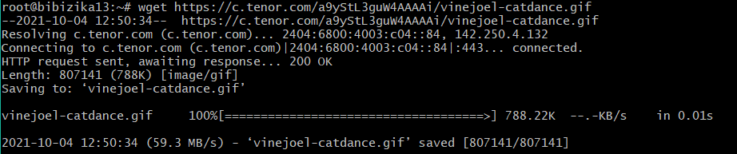

# Лабораторная работа №6. Основные сетевые утилиты

## Цель

Получить практические навыки работы с утилитами для сетевого администрирования с использованием командной оболочки Bash.

## Постановка задачи:

Подключиться к серверу по SSH, выполнить ряд команд сетевого администрирования.

## Анализ задачи
- Исследование источников;
- Подключение к удалённому серверу по SSH с использованием Putty/Terminal;
- Использование ip, ifconfig, traceroute, dig, nslookup;
- Скачивание файлов с использованием wget;
- Отправка HTTP-запросов с использованием curl;
- Прослушка порта с использованием nc (netcat);
- Отправить HTTP-запрос с помощью wget на сервер (ip:port) собеседника, который открыл порт с помощью nc;
- Отправить HTTP-запрос с помощью curl на сервер (ip:port) собеседника, который открыл порт с помощью nc;
- Отправка сообщений с использованием telnet на сервер (ip:port) собеседника, который открыл порт с помощью nc.

## Отчет

